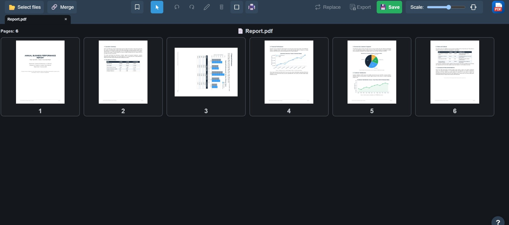
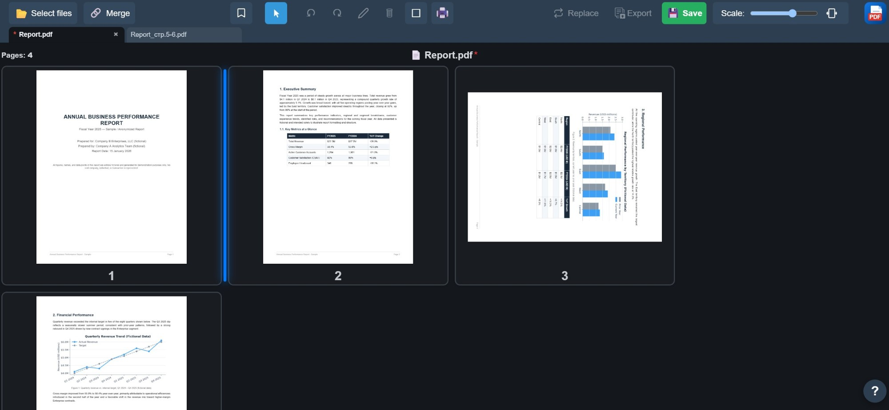
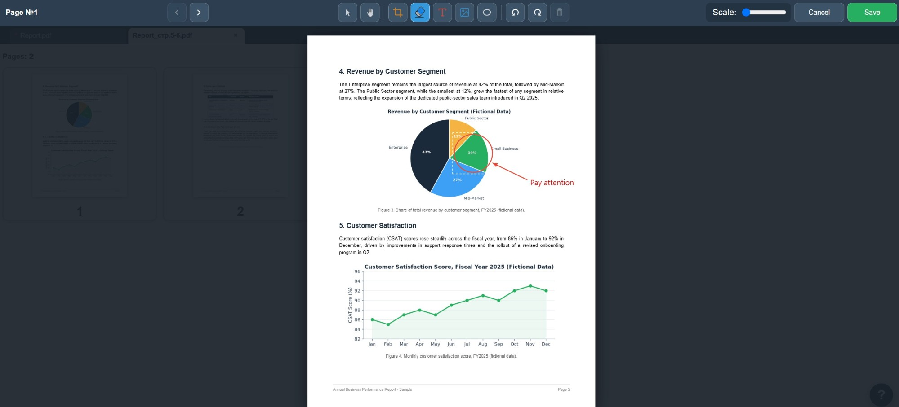
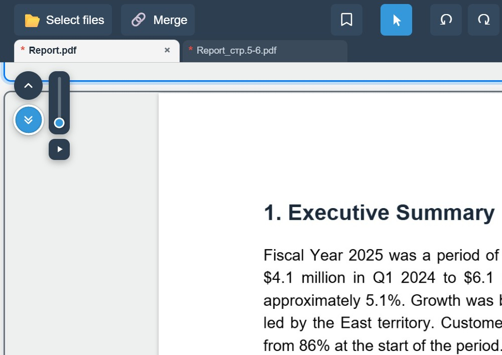
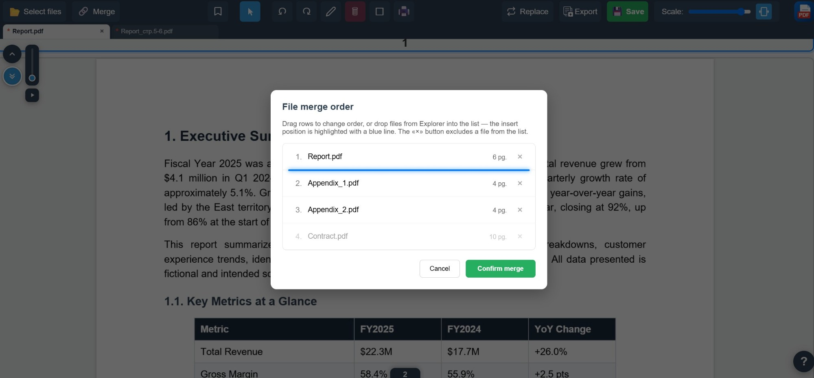

# PDF Document Manager in a <b>single HTML-file</b>

  <a href="#english">🇬🇧 English</a> · <a href="#русский">🇷🇺 Русский</a>

**A PDF editor that runs entirely in your browser.** Merge and split PDFs, edit pages, manage bookmarks, convert Word/Excel/email files — all in a single HTML file, nothing to install. Your files never leave your computer: everything happens locally, nothing is uploaded to a server.

<table>
<tr>
<td align="center" width="20%">
 
Page thumbnails
</td>
<td align="center" width="20%">
 
Tabs & splitting pages
</td>
<td align="center" width="20%">
 
Page editor — shapes, arrows & text
</td>
<td align="center" width="20%">
 
Floating scroll navigator
</td>
<td align="center" width="20%">
 
Merge with custom order
</td>
</tr>
</table>

*(click a thumbnail to open it full-size)*

### Download

| Method | Link |
|--------|------|
| **Open online** | https://65WebDev.github.io/PDF-Manager/PDF_manager_online.html |
| **Download online version** | https://github.com/65WebDev/PDF-Manager/releases/latest/download/PDF_manager_online.html |
| **Download offline version** | https://github.com/65WebDev/PDF-Manager/releases/latest/download/PDF_manager_offline.html |
| **Windows: installer** | https://github.com/65WebDev/PDF-Manager/releases/download/windows-v0.1.31/PDF.Manager_0.1.31_x64-setup.exe |
| **Windows: portable `.exe`** | https://github.com/65WebDev/PDF-Manager/releases/download/windows-v0.1.31/pdf-manager.exe |
| **Linux: `.deb`** | https://github.com/65WebDev/PDF-Manager/releases/download/linux-v0.1.31/PDF.Manager_0.1.31_amd64.deb|
| **Linux: `.AppImage`** | https://github.com/65WebDev/PDF-Manager/releases/download/linux-v0.1.31/PDF.Manager_0.1.31_amd64.AppImage|
| **Windows release** | https://github.com/65WebDev/PDF-Manager/releases/tag/windows-v0.1.31 |
| **Linux release** | https://github.com/65WebDev/PDF-Manager/releases/tag/linux-v0.1.31 |

After downloading, open the HTML file in your browser. The online version loads its libraries from a CDN; the offline version bundles everything inside the file and works without internet access.

### Features

- **Page management** — merge, split, drag to reorder, delete and rotate pages.
- **Built-in page editor** — add and edit text and images directly on a PDF page.
- **Bookmarks & table of contents** — hierarchical bookmarks with multi-select, drag reordering, and bulk delete.
- **Clickable internal links** — follow links and table-of-contents entries in the viewer.
- **Smart zoom** — crisp rendering at any zoom level, snaps to page width (wheel/slider on desktop, pinch-to-zoom on mobile).
- **Multiple documents at once** *(desktop only)* — several PDFs in tabs, one window.
- **Import from Word, Excel & email** — `.docx`, `.xlsx`, `.eml` and `.msg` converted to PDF automatically.
- **Image compression** — reduce the PDF file size without losing readability.
- **Password & encryption** — set a password on a PDF right in the browser, no third-party service involved.

**Supported interface languages:** English, Russian, Spanish, Chinese.

**Embedded libraries:**

- **pdf-lib** v1.17.1 — PDF assembly and editing (pages, rotation, merging, saving)
- **pdf.js** v5.4.149 — rendering PDF pages (thumbnails, preview)
- **mammoth** v1.12.1 — converting Word (`.docx`) files to HTML on import
- **SheetJS (xlsx)** v0.18.5 — reading Excel (`.xls`/`.xlsx`) tables on import
- **html2canvas** v1.4.1 — rasterizing HTML markup into an image for PDF assembly
- **JSZip** v3.10.1 — unpacking `.docx` archives for docx-preview
- **docx-preview** v0.4.0 — page-accurate rendering of Word documents
- **ExcelJS** v4.4.0 — reading styled Excel tables with print/pagination settings
- **postal-mime** v3.0.0 — parsing email messages (`.eml`)
- **@kenjiuno/msgreader-web-ng** v0.2.0-alpha1 — parsing Outlook messages (`.msg`)
- **@kenjiuno/decompressrtf** v0.1.4 — decompressing RTF bodies inside `.msg` files
- **@cantoo/pdf-lib** v2.9.1 — opening password-protected PDFs
- **@pdf-lib/fontkit** v1.1.1 — embedding a Unicode font for non-Latin text in filled-in form fields

---

**Редактор PDF, который работает прямо в браузере.** Слияние и разбиение PDF, редактирование страниц, закладки, конвертация Word/Excel/почты — всё в одном HTML-файле, ничего устанавливать не нужно. Файлы не покидают ваш компьютер: вся обработка происходит локально, без загрузки на сервер.

<table>
<tr>
<td align="center" width="20%">
 
Миниатюры страниц
</td>
<td align="center" width="20%">
 
Вкладки и перенос страниц
</td>
<td align="center" width="20%">
 
Редактор страниц — фигуры, стрелки, текст
</td>
<td align="center" width="20%">
 
Навигатор прокрутки
</td>
<td align="center" width="20%">
 
Слияние с настройкой порядка
</td>
</tr>
</table>

*(нажмите на миниатюру, чтобы открыть в полном размере)*

### Скачать

| Способ | Ссылка |
|--------|--------|
| **Открыть онлайн** | https://65WebDev.github.io/PDF-Manager/PDF_manager_online.html |
| **Скачать онлайн-версию** | https://github.com/65WebDev/PDF-Manager/releases/latest/download/PDF_manager_online.html |
| **Скачать офлайн-версию** | https://github.com/65WebDev/PDF-Manager/releases/latest/download/PDF_manager_offline.html |
| **Windows: установщик** | https://github.com/65WebDev/PDF-Manager/releases/download/windows-v0.1.31/PDF.Manager_0.1.31_x64-setup.exe |
| **Windows: portable `.exe`** | https://github.com/65WebDev/PDF-Manager/releases/download/windows-v0.1.31/pdf-manager.exe |
| **Linux: `.deb`** | https://github.com/65WebDev/PDF-Manager/releases/download/linux-v0.1.31/PDF.Manager_0.1.31_amd64.deb|
| **Linux: `.AppImage`** | https://github.com/65WebDev/PDF-Manager/releases/download/linux-v0.1.31/PDF.Manager_0.1.31_amd64.AppImage|
| **Релиз Windows** | https://github.com/65WebDev/PDF-Manager/releases/tag/windows-v0.1.31 |
| **Релиз Linux** | https://github.com/65WebDev/PDF-Manager/releases/tag/linux-v0.1.31 |

После скачивания откройте HTML-файл в браузере. Онлайн-версия подгружает библиотеки из CDN; офлайн-версия содержит все зависимости внутри файла и работает без интернета.

### Возможности

- **Управление страницами** — слияние, разбиение, перетаскивание, удаление и поворот страниц.
- **Встроенный редактор страниц** — добавление и редактирование текста и изображений прямо на странице PDF.
- **Закладки и оглавление** — иерархические закладки с множественным выделением, перетаскиванием и групповым удалением.
- **Внутренние ссылки** — переходы по ссылкам и оглавлению прямо в просмотре.
- **Умный зум** — чёткий рендер на любом приближении, магнит к ширине страницы (колесо/ползунок на десктопе, pinch-to-zoom на мобильном).
- **Несколько документов сразу** *(только десктоп)* — несколько PDF во вкладках одного окна.
- **Импорт из Word, Excel и почты** — `.docx`, `.xlsx`, `.eml` и `.msg` конвертируются в PDF автоматически.
- **Сжатие изображений** — уменьшение размера файла без потери читаемости.
- **Пароль и шифрование** — установка пароля на PDF прямо в браузере, без сторонних сервисов.

**Поддерживаемые языки интерфейса:** русский, английский, испанский, китайский.

**Используемые библиотеки:**

- **pdf-lib** v1.17.1 — сборка и редактирование PDF (страницы, поворот, слияние, сохранение)
- **pdf.js** v5.4.149 — рендер страниц PDF (миниатюры, предпросмотр)
- **mammoth** v1.12.1 — конвертация файлов Word (`.docx`) в HTML при импорте
- **SheetJS (xlsx)** v0.18.5 — чтение таблиц Excel (`.xls`/`.xlsx`) при импорте
- **html2canvas** v1.4.1 — растеризация HTML-разметки в изображение для сборки PDF
- **JSZip** v3.10.1 — распаковка `.docx`-архивов для docx-preview
- **docx-preview** v0.4.0 — постраничный рендер документов Word
- **ExcelJS** v4.4.0 — чтение таблиц Excel со стилями и настройками печати
- **postal-mime** v3.0.0 — разбор писем (`.eml`)
- **@kenjiuno/msgreader-web-ng** v0.2.0-alpha1 — разбор писем Outlook (`.msg`)
- **@kenjiuno/decompressrtf** v0.1.4 — распаковка RTF-тела в файлах `.msg`
- **@cantoo/pdf-lib** v2.9.1 — открытие PDF-файлов, защищённых паролем
- **@pdf-lib/fontkit** v1.1.1 — встраивание Unicode-шрифта для нелатинского текста в заполняемых полях форм
